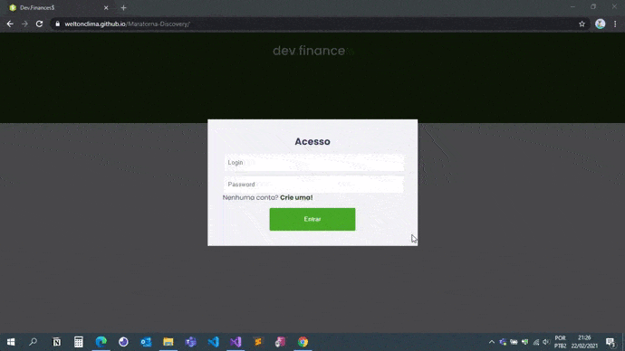

  

  

  

  
  
  
  
 

<h1 align="center">
    
</h1>

<h4 align="center"> 
	🚧  Concluído 🚧
</h4>

## 💻 Sobre o projeto - Dev.finance$

Foi Desenvolvido na Maratona Discovery pelo mestre [Mayk Brito](https://github.com/maykbrito) onde foi possivel aprender muito sobre as linguagens base para o Desenvolvimento Web.

---

## ⚙️ Melhorias

- [x] Abaixo algumas melhorias :
  - [x] Janela de Login e Cadastro com validações de campos
  - [x] Cada Usuário tem acesso as suas transações
  - [x] Efeitos CSS nos cartões de transações com efeitos 3D
  - [x] Adicionado icone para edita as transações
  - [x] Tema Drácula
  - [x] icone excluir precisa clica duas vezes para confirma 

---

## 🛠 Tecnologias

As seguintes ferramentas foram usadas na construção do projeto:

- [HTML5](https://developer.mozilla.org/pt-BR/docs/Web/HTML)
- [CSS3](https://developer.mozilla.org/pt-BR/docs/Web/CSS)
- [JavaScrit](https://developer.mozilla.org/pt-BR/docs/Web/JavaScript)

